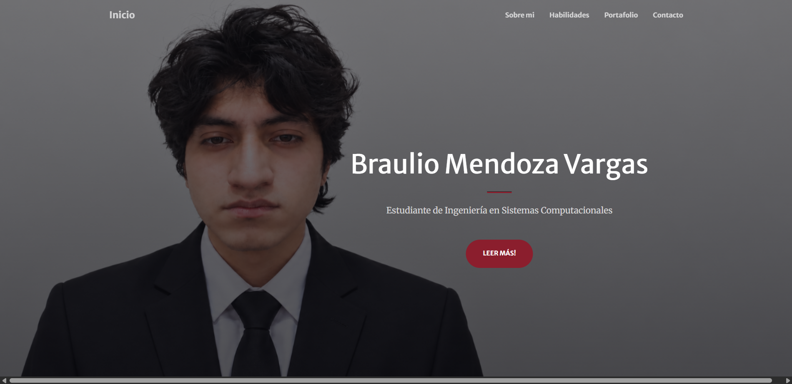
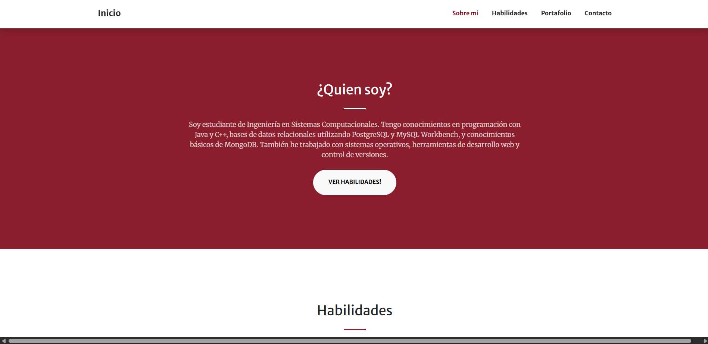
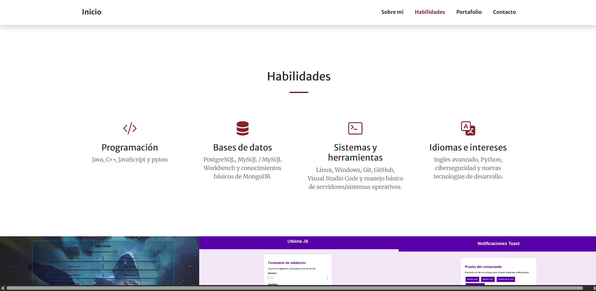
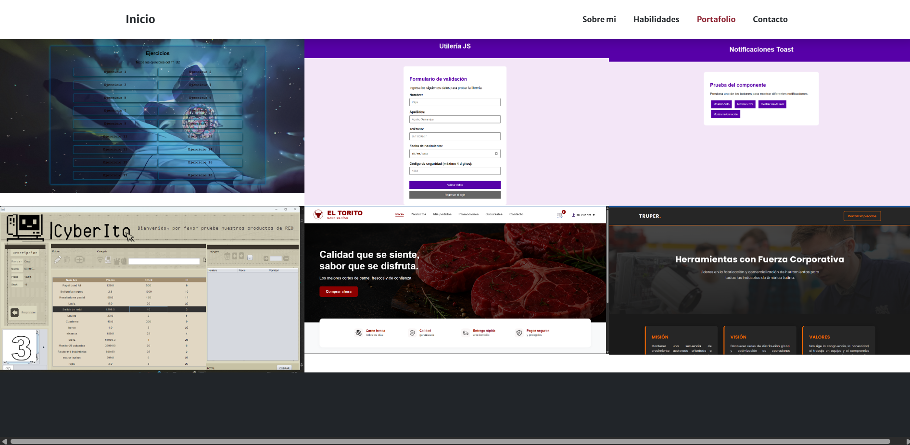
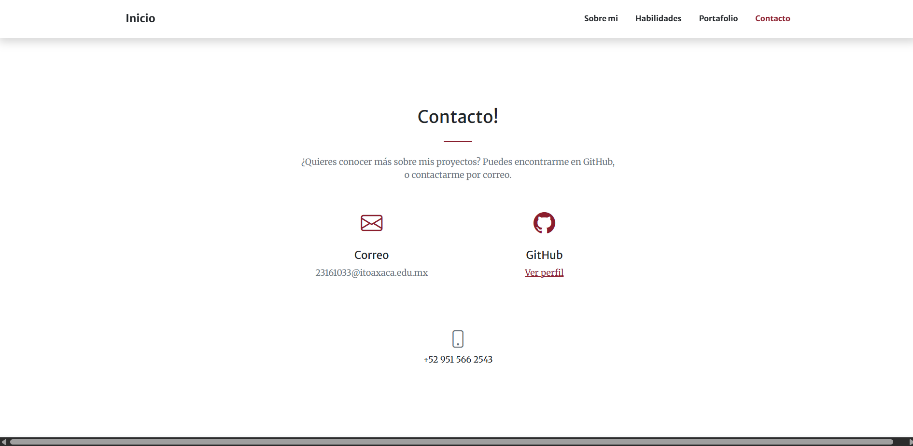

# Portafolio Web - Braulio Mendoza Vargas

## Descripción

El portafolio fue creado a partir de una plantilla de **Start Bootstrap**, utilizando **Bootstrap**, HTML, CSS y JavaScript. La plantilla fue modificada para adaptar su diseño, colores, contenido, imágenes y secciones a un portafolio personal enfocado en mostrar información académica, habilidades y proyectos realizados.

El sitio cuenta con un diseño responsivo, por lo que puede visualizarse tanto en computadora como en dispositivos móviles.

---

## Plantilla utilizada

Para desarrollar el portafolio se utilizó la plantilla:

**Creative - Start Bootstrap**

Página oficial:

https://startbootstrap.com/theme/creative

Repositorio original:

https://github.com/StartBootstrap/startbootstrap-creative

La plantilla utiliza Bootstrap como base para los estilos y componentes del sitio.

---

## Tecnologías utilizadas

- HTML5
- CSS3
- JavaScript
- Bootstrap 5
- Bootstrap Icons
- SimpleLightbox
- Git y GitHub
- GitHub Pages

---

# Secciones del portafolio

## Inicio

La sección de inicio muestra mi nombre.

**Braulio Mendoza Vargas**

También se incluye la descripción.

**Estudiante de Ingeniería en Sistemas Computacionales**

Como fondo se utilizó una fotografía personal con vestimenta formal, adaptándola al diseño del portafolio.

También se modificó la combinación de colores original de la plantilla por tonos rojos oscuros para darle un estilo más personalizado.

---

## Sobre mí

Esta sección presenta una breve descripción personal y académica.

Se incluyen conocimientos relacionados con:

- Programación
- Bases de datos
- Sistemas operativos
- Desarrollo web
- Control de versiones

También se incluye un botón que dirige directamente a la sección de habilidades.

---

## Habilidades

Las habilidades se organizaron en cuatro categorías principales.

### Programación

- Java
- C++
- JavaScript
- Python como tecnología de interés y aprendizaje

### Bases de datos

- PostgreSQL
- MySQL
- MySQL Workbench
- Conocimientos básicos de MongoDB

### Sistemas y herramientas

- Linux
- Windows
- Git
- GitHub
- Visual Studio Code
- Manejo básico de servidores y sistemas operativos

### Idiomas e intereses

- Inglés
- Python
- Ciberseguridad
- Nuevas tecnologías de desarrollo

Para representar visualmente cada categoría se utilizaron iconos de Bootstrap Icons.

---

## Portafolio

La sección de portafolio muestra distintos proyectos y trabajos realizados durante la formación académica.

Entre los proyectos mostrados se encuentran:

### Index

Proyecto desarrollado utilizando JavaScript como parte de las actividades de Programación Web.

### Utilería JavaScript

Proyecto enfocado en la creación de funciones reutilizables en JavaScript para realizar validaciones de formularios y datos.

### Componente Toast

Componente desarrollado con JavaScript para mostrar diferentes tipos de notificaciones, como mensajes de éxito, error e información.

### Sistema para un ciber

Proyecto desarrollado en Java orientado a la administración de un cibercafé.

### Sistema para una carnicería

Proyecto para la administración y control de información de una carnicería.

### Página web para ferretería

Página web desarrollada utilizando HTML para mostrar información relacionada con una ferretería.

Las imágenes de cada proyecto pueden ampliarse utilizando el componente SimpleLightbox incluido en la plantilla.

También se agregó un acceso al perfil de GitHub para consultar otros proyectos y repositorios.

---

## Contacto

La sección de contacto muestra información básica para poder conocer más acerca de los proyectos realizados.

Incluye:

- Correo institucional
- Perfil de GitHub

El formulario original de la plantilla fue eliminado para evitar depender del servicio externo SB Forms y se sustituyó por información de contacto directa.

---

# Proceso de creación

## 1. Selección de la plantilla

Primero se buscaron diferentes plantillas de portafolio desarrolladas con Bootstrap.

Se eligió **Creative de Start Bootstrap** debido a que:

- Utiliza Bootstrap.
- Está desarrollada con HTML, CSS y JavaScript.
- No utiliza frameworks de JavaScript como React o Vue.
- Cuenta con una sección de portafolio.
- Tiene diseño responsivo.
- Permite modificar fácilmente los estilos y contenidos.
- Puede publicarse mediante GitHub Pages.

---

## 2. Descarga de la plantilla

La plantilla fue descargada desde el repositorio oficial de Start Bootstrap.

Después se utilizó principalmente el contenido generado dentro de la carpeta `dist`, donde se encuentran los archivos necesarios para ejecutar el sitio directamente.

---

## 3. Modificación de contenido

Se modificaron los textos originales de la plantilla para adaptarlos a un portafolio personal.

Entre los principales cambios realizados se encuentran:

- Cambio del nombre de la página.
- Traducción de las secciones al español.
- Modificación de la presentación principal.
- Creación de una sección personal.
- Adaptación de la sección de servicios a habilidades.
- Modificación de la sección de portafolio.
- Sustitución de imágenes.
- Modificación de la sección de contacto.
- Actualización del pie de página.

---

## 4. Personalización del diseño

La plantilla originalmente utilizaba tonos naranja.

El color principal fue cambiado por un tono rojo oscuro:

```css
#8B1E2D
```

También se modificaron colores secundarios y transparencias para mantener una apariencia uniforme.

Se modificó además la imagen principal del portafolio y su posición para mejorar la distribución entre la fotografía y los textos.

---

## 5. Personalización de habilidades

La sección original de servicios de la plantilla fue reutilizada para mostrar habilidades.

Los elementos originales fueron sustituidos por:

- Programación
- Bases de datos
- Sistemas y herramientas
- Idiomas e intereses

También se cambiaron los iconos originales por Bootstrap Icons relacionados con cada categoría.

---

## 6. Adaptación del portafolio

Las imágenes originales de ejemplo fueron sustituidas por capturas correspondientes a proyectos realizados.

También se modificaron:

- Nombre de los proyectos.
- Tecnología utilizada.
- Imágenes.
- Descripciones.
- Acceso al perfil de GitHub.

---

## 7. Modificación del contacto

El formulario original utilizaba el servicio SB Forms.

Para este proyecto se decidió eliminar dicho formulario y utilizar información de contacto directa.

Esto permite mantener el sitio completamente estático y compatible con GitHub Pages.

---

# Capturas de pantalla

## Página principal





## Sobre mí




## Habilidades



## Portafolio




## Contacto





# Repositorio

Repositorio del proyecto:

https://github.com/mendozavargasbraulio/Actividad4-portafolio

---

# GitHub Pages

Portafolio publicado:

https://mendozavargasbraulio.github.io/Actividad4-portafolio/

---

## Autor

**Braulio Mendoza Vargas**

Estudiante de Ingeniería en Sistemas Computacionales.

---

## Créditos

Este proyecto utiliza como base la plantilla **Creative** desarrollada por Start Bootstrap.

Plantilla original:

https://startbootstrap.com/theme/creative

Repositorio:

https://github.com/StartBootstrap/startbootstrap-creative